# travel_backstage

## 白云旅途后台管理系统

## 1项目介绍

白云旅途后台管理系统是一个使用SSM整合的练手项目，主要实现的功能：产品查询，产品添加，订单查询，订单分页查询，订单详情查询，使用Spring Security完成权限关联控制，用户管理，角色管理，资源权限管理，Aop日志管理。

  

# 2.技术选型

## 2.1.相关技术

前端技术：

- 基础的HTML、CSS、JavaScript（基于ES6标准）
- JQuery
  后端技术：

- 基础的SpringMVC、Spring 5.x和MyBatis3
- mysql   8.0.17
- Spring Security

## 2.2.开发环境

- IDE：IntelliJ IDEA 2019.1.3 x64 版本
- JDK： JDK1.8
- 项目构建：maven3.6.0
- 版本控制工具：git

## 2.3项目截图

### 2.4 登陆页面

  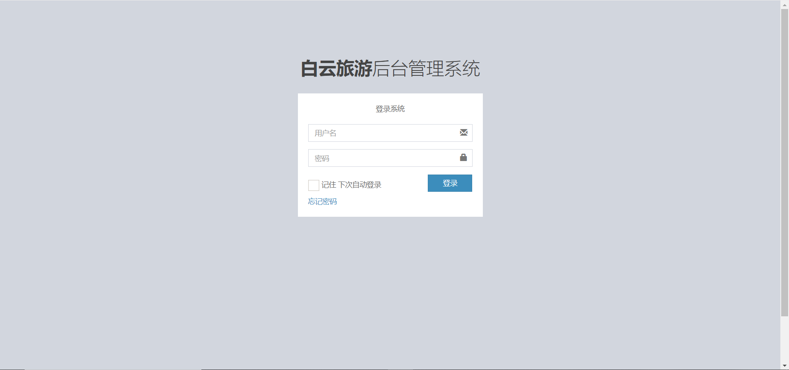

### 2.5 产品管理页面

  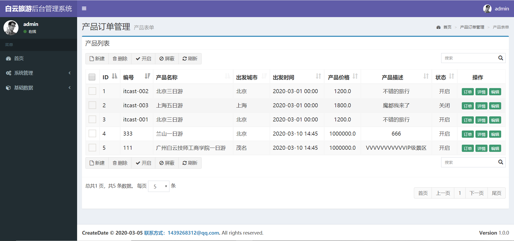

### 2.6 订单管理页面

  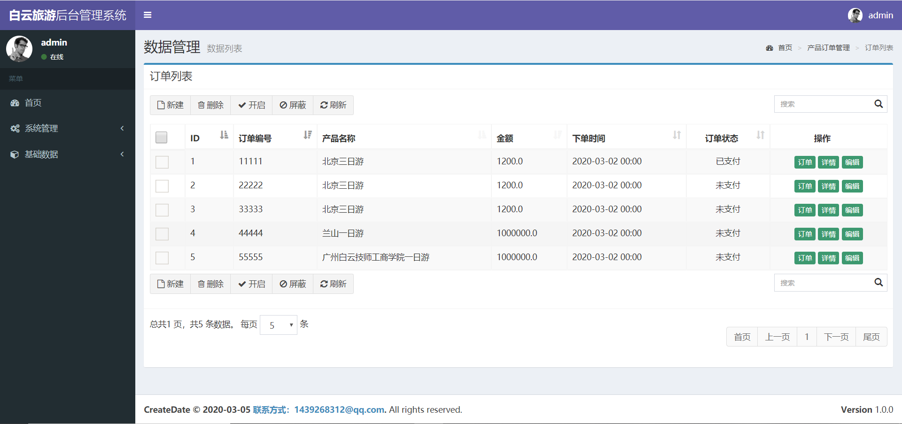

### 2.7 订单详情页面

  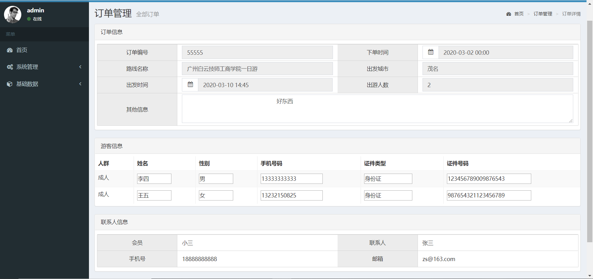

### 2.8 角色管理页面

  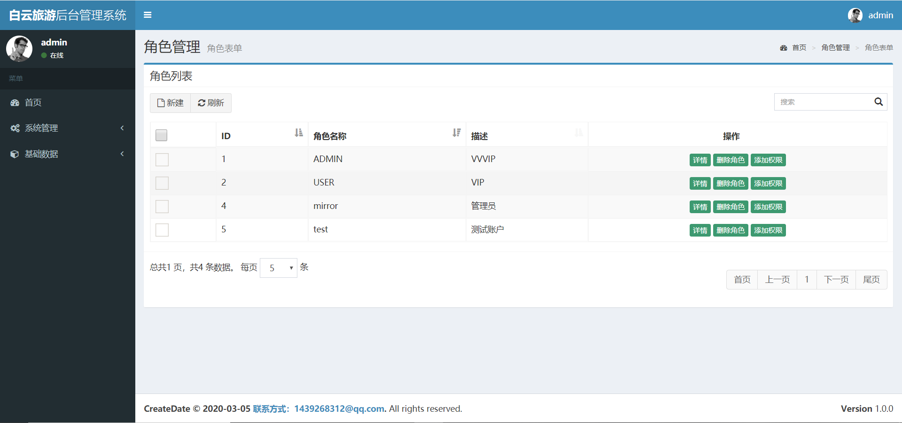

### 2.9 权限详情页面

  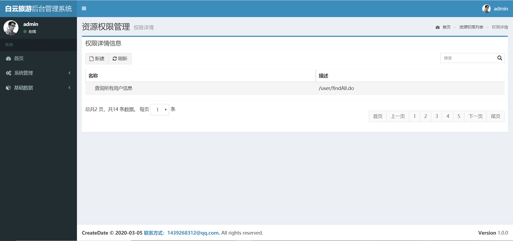

### 2.10 日志列表页面

  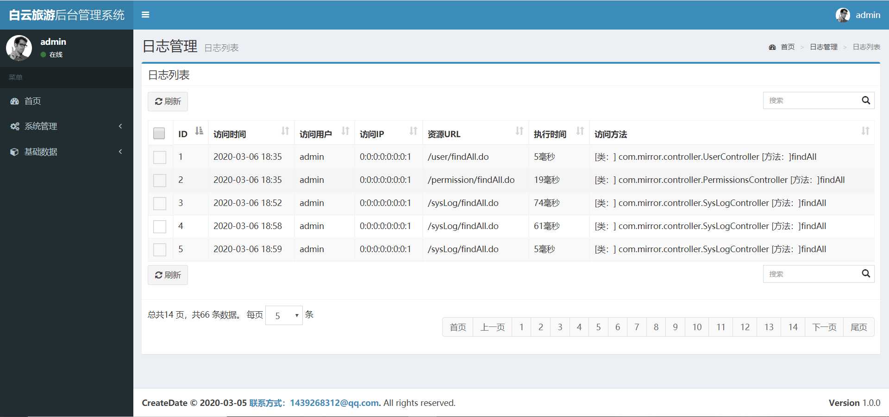

### 2.11 添加产品页面

  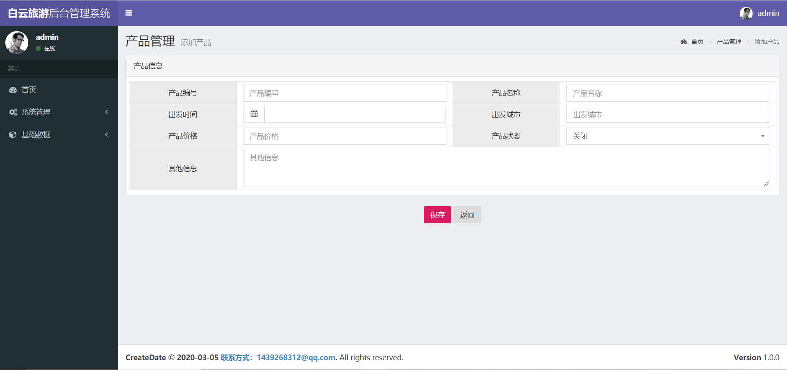

### 2.12 添加角色页面

  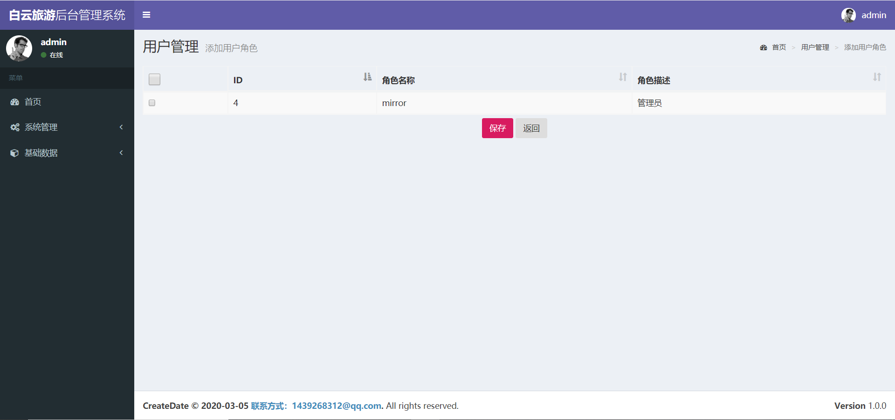

### 2.13 用户管理页面

  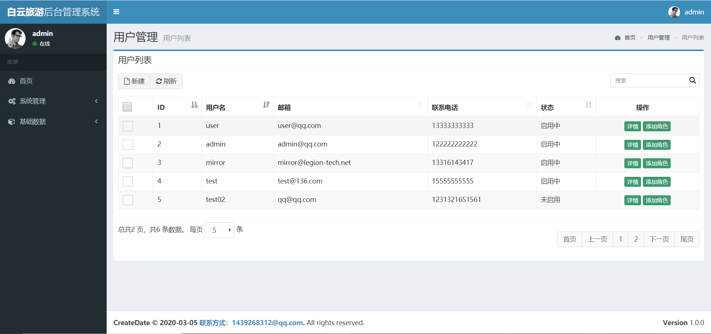

### 2.14 用户详情页面

  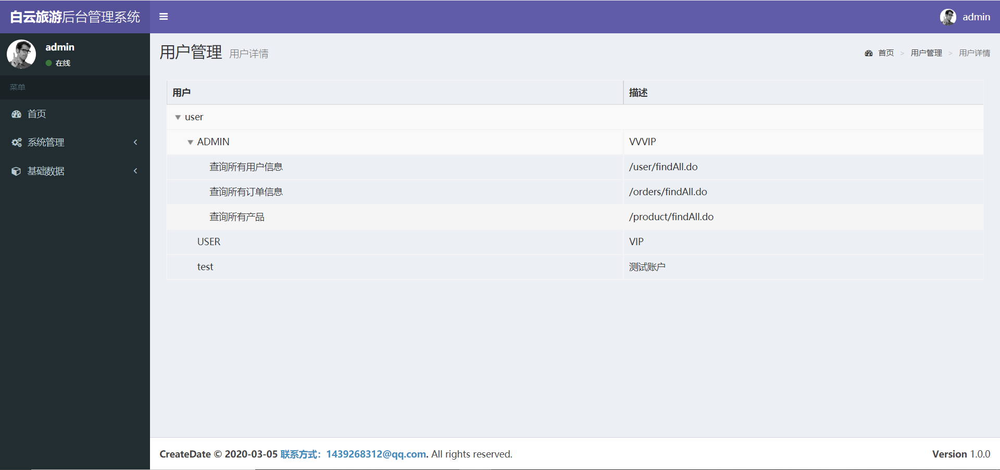

